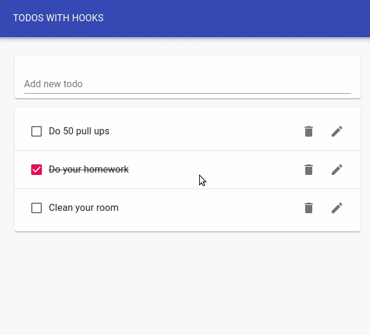

# Yet another ToDo App!

## Main features:
- add, remove and edit tasks from the list;
- can be used offline - PWA;
- responsiveness;
- localstorage is used for storing tasks;
- every component is function based;
- context, reducers and hooks were used for state management;

## Libraries:
- React - building ui;
- Material-UI - styling components;
- uuid library - creating unique ID's of components;

Made with [create-react-app](https://github.com/facebook/create-react-app)
